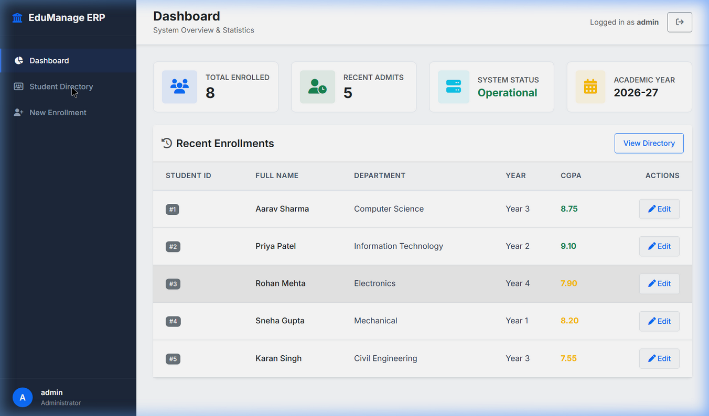
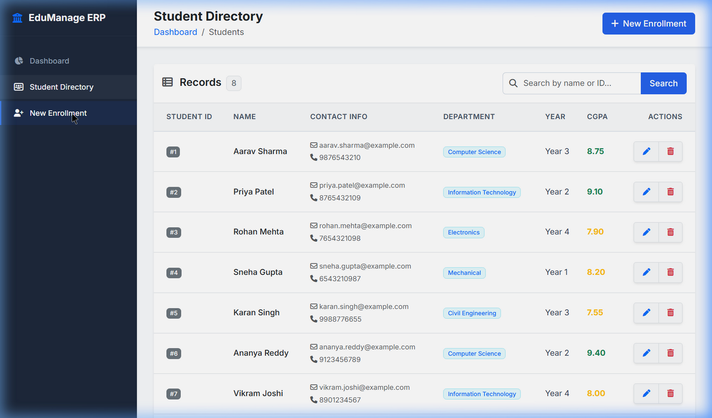
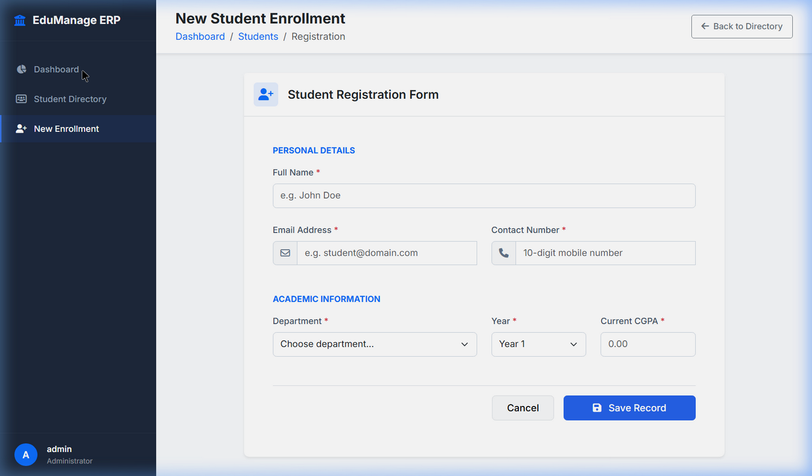
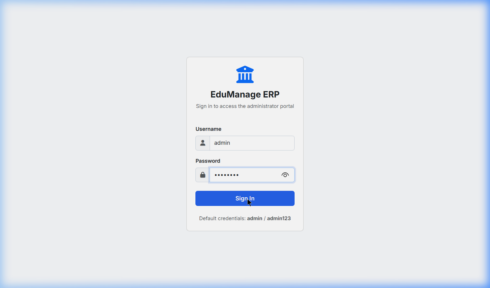

# 🎓 Student Management System (Java Full-Stack Enterprise)

## 📌 Description
A fully functional, enterprise-grade **Student Management System** upgraded from a desktop application to a modern, responsive web application. 
This project is built using the Java Full-Stack architecture (Servlets, JSP, JDBC, MySQL) and features a professional HTML5/CSS3/JavaScript frontend with Bootstrap 5.

---

## 📸 Screenshots

### 1. Admin Dashboard
The main landing area giving a high-level overview of total students enrolled and system statistics.

### 2. Student Directory
A paginated, responsive data table allowing the admin to view, search, edit, and delete student records.

### 3. Registration Form
A clean, Bootstrap 5 validated form for enrolling new students into the system.

### 4. Secure Login
Authentication portal with server-side session management.

---

## ⚙️ How It Works (Architecture)

This application follows the standard **Model-View-Controller (MVC)** architectural pattern, which provides a clean separation of concerns:

### 1. Model (Data Layer)
* **POJOs:** The `Student.java` class acts as the core data structure holding individual student attributes (ID, Name, Email, Department, CGPA, etc.).
* **DAO Pattern:** The `StudentDAO.java` and `AdminDAO.java` classes encapsulate all database interactions. They use Java JDBC `PreparedStatement`s to execute CRUD operations securely, protecting the system against SQL Injection.
* **Singleton DB Connection:** `DBConnection.java` manages a single, persistent connection to the MySQL database, preventing connection leaks and reducing overhead.

### 2. View (Presentation Layer)
* **JSPs:** The frontend is rendered dynamically using JavaServer Pages (`dashboard.jsp`, `students.jsp`, `student-form.jsp`).
* **Design System:** It leverages standard HTML5 semantic tags (`<main>`, `<aside>`), CSS3, and the Bootstrap 5 framework to deliver a responsive, enterprise-style interface.
* **Client-Side Validation:** JavaScript handles frontend validation to ensure clean data before submission.

### 3. Controller (Business Logic Layer)
* **Java Servlets:** `StudentServlet.java`, `LoginServlet.java`, and `DashboardServlet.java` act as the application's controllers. 
* **Routing:** When a user interacts with the UI (e.g., clicking "Add Student"), the Servlet intercepts the HTTP request, processes any parameters, communicates with the Model (DAO), and forwards the HTTP response to the appropriate JSP View.
* **Session Management:** `LoginServlet.java` creates a secure `HttpSession` upon successful login, while other Servlets verify this session to protect endpoints from unauthorized access.

---

## 🚀 Features

### 📋 Core Features
- ➕ **Add Student:** Register new students with academic & personal details.
- 👁️ **View Students:** Read all students with a responsive, paginated data table.
- 🔍 **Search Student:** Dynamic search by name or ID.
- ✏️ **Update Student:** Edit existing student records seamlessly.
- 🗑️ **Delete Student:** Secure deletion with confirmation modals.

### 🛡️ Advanced Features
- **Authentication:** Secure Admin login with server-side session management and 30-minute timeouts.
- **Enterprise UI:** Corporate dashboard built with Bootstrap 5, FontAwesome icons, and semantic HTML5.
- **Data Persistence:** Integrated with MySQL via JDBC using the Data Access Object (DAO) pattern.
- **Pagination:** Server-side pagination limiting records to 8 per page for performance.
- **Validation:** Both client-side (HTML5/JS) and server-side validation.

---

## 💻 Technologies Used

**Frontend:**
- HTML5 & CSS3
- JavaScript
- JSP (JavaServer Pages)
- Bootstrap 5
- FontAwesome 6

**Backend:**
- Java 17+
- Java Servlets (Tomcat 9 compatible)
- JDBC (Java Database Connectivity)
- Maven

**Database:**
- MySQL 8.x

---

## 🛠️ Setup & Deployment

1. **Database:** 
   - Execute the SQL script located in `sql/schema.sql` on your MySQL server to create the `student_management_db` and necessary tables.
   - Default admin credentials: `admin` / `admin123`.

2. **Configuration:**
   - Update `src/main/java/com/sms/util/DBConnection.java` with your MySQL credentials if they differ from `root` / `root`.

3. **Build:**
   - Package the project using Maven: `mvn clean package`

4. **Deploy:**
   - Deploy the generated `StudentManagementSystem.war` to Apache Tomcat 9.
   - Access the application at `http://localhost:8080/StudentManagementSystem`.
